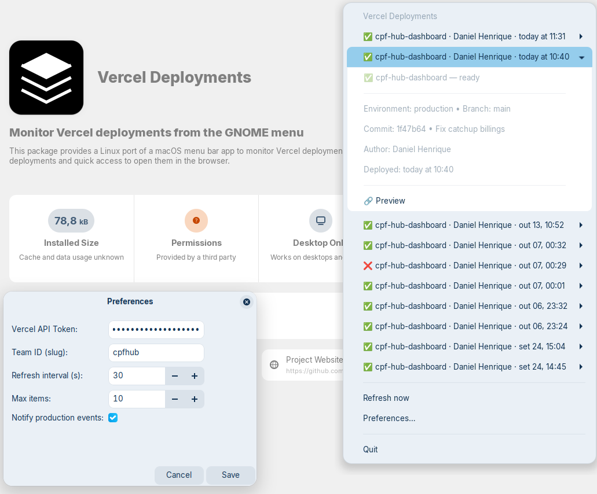

# Vercel Deployments (Linux)

Linux port of the macOS menu bar app to monitor Vercel deployments.
Inspired by the macOS project: vercel-deployment-menu-bar (`https://github.com/andrewk17/vercel-deployment-menu-bar`).



## Features

- Real-time deployment status (building, ready, error)
- Tray icon with a menu of recent deployments (one click opens the deployment URL)
- Preferences dialog: Vercel API Token, optional Team ID (slug), refresh interval, max items
- Desktop notifications on overall status changes
- Native notifications for production deployment events (enabled by default; can be disabled in Preferences)

## Requirements

- Python 3.8+
- GTK 3, libnotify and AppIndicator (Ayatana) bindings:
  - `python3-gi`, `gir1.2-gtk-3.0`, `gir1.2-notify-0.7`
  - `gir1.2-ayatanaappindicator3-0.1` (or `gir1.2-appindicator3-0.1`)
  - `libayatana-appindicator3-1` (or `libappindicator3-1`)
- `python3-requests` (installed by the .deb or via pip in dev)

## Desktop compatibility

This app uses AppIndicator/StatusNotifierItem (Ayatana). It works on desktops that support it:

- KDE Plasma: works out of the box (shows in the system tray)
- GNOME: needs AppIndicator support. On Ubuntu it's enabled; on vanilla GNOME:
  ```bash
  sudo apt install -y gnome-shell-extension-appindicator libayatana-appindicator3-1 gir1.2-ayatanaappindicator3-0.1
  # Restart the GNOME shell or log out/in (Alt+F2, r on Xorg)
  ```
- elementary OS (Pantheon):
  ```bash
  sudo apt install -y wingpanel-indicator-ayatana libayatana-appindicator3-1
  ```
- Cinnamon / MATE / Xfce / LXQt: usually tray-ready; ensure Ayatana libs are installed:
  ```bash
  sudo apt install -y libayatana-appindicator3-1 gir1.2-ayatanaappindicator3-0.1
  ```

## Install from .deb

### Option 1: Download from GitHub Releases (Recommended)

1. Go to [Releases](https://github.com/danihenrique/vercel-deployments/releases)
2. Download the latest `vercel-deployments_*.deb` file
3. Install:
```bash
sudo dpkg -i vercel-deployments_*.deb || sudo apt -f install -y
```

### Option 2: Build from source

1) Install build tools:
```bash
sudo apt update
sudo apt install -y build-essential debhelper dh-python python3-all pybuild-plugin-pyproject
```

2) Build the package:
```bash
dpkg-buildpackage -us -uc -b
```

3) Install the resulting .deb (path may vary):
```bash
sudo dpkg -i ../vercel-deployments_1.0.0-1_all.deb || sudo apt -f install -y
```

4) Launch from your desktop menu: "Vercel Deployments" (or run `vercel-deployments`).

## Configuration

### Step 1: Generate a Vercel API Token

1. Go to [Vercel Account Settings → Tokens](https://vercel.com/account/tokens)
2. Click "Create Token"
3. Give your token a name (e.g., "Menu Bar App")
4. Choose the scope:
   - Personal Account: Select your personal account scope
   - Team Account: Select the specific team you want to monitor
5. Set an expiration date (optional but recommended)
6. Click "Create Token"
7. Important: Copy the token immediately — you won't be able to see it again!

### Step 2: Configure the App

1. Launch the app from your desktop menu (or run `vercel-deployments`)
2. Click the tray icon
3. Select "Preferences"
4. Enter your API token in the "Token" field

### Step 3: Configure Team ID (Only if you scoped the token to a team)

If you created a token scoped to a specific team, you must also enter your Team ID (team slug):

1. In the Preferences window, locate the "Team ID" field
2. To find your Team ID:
   - Go to your Vercel Dashboard
   - Select your team from the dropdown
   - Look at the URL — it will be: `https://vercel.com/[TEAM_ID]/~`
   - The `[TEAM_ID]` is what you need (e.g., if the URL is `https://vercel.com/acme-corp/~`, your Team ID is `acme-corp`)
   - Alternatively, go to Team Settings → General and find your Team Slug
3. Enter the Team ID in the preferences
4. Click "Save"

Note: If you used a personal account token, you can leave the Team ID field empty.

## Rebuild (dev loop)

Rebuild and reinstall quickly during development:

```bash
# Option 1: Use the build script
./scripts/build-release.sh

# Option 2: Manual build
dpkg-buildpackage -us -uc -b
sudo dpkg -i ../vercel-deployments_*_all.deb || sudo apt -f install -y

# Restart the app
# Prefer using the tray menu: Quit → launch again from the desktop menu
# If needed after icon changes:
sudo gtk-update-icon-cache -f /usr/share/icons/hicolor
```

## First run

Open Preferences and enter your Vercel API Token. If your token is scoped to a team, also fill in your Team ID (team slug). Save.

Configuration file location:
- `~/.config/vercel-deployments/config.json`

## Development

Create a virtual environment and install in editable mode:
```bash
python3 -m venv .venv
source .venv/bin/activate
pip install -U pip build ruff
pip install -e .
```

Run locally:
```bash
vercel-deployments
```

## Lint / format

- Without just:
```bash
ruff check --fix .
ruff format .
```

- With just (optional):
```bash
sudo apt install -y just
just lint-sync
```

## How it works

- Polls the Vercel API periodically to fetch recent deployments
- Overall icon reflects the most relevant state among recent deployments:
  - building/queued → building icon
  - error/canceled → error icon
  - otherwise → ready icon
- Click any menu item to expand details, then click "🔗 Preview" to open the deployment in your browser

## Troubleshooting

- No tray icon: ensure Ayatana AppIndicator packages are installed and restart your session/shell
- Unauthorized (401): check your API token and team scope/slug
- No deployments: confirm the token has access to the account/team and projects

## Acknowledgements

- macOS inspiration: vercel-deployment-menu-bar (`https://github.com/andrewk17/vercel-deployment-menu-bar`)
- Linux port by: [@danihenrique](https://github.com/danihenrique)
